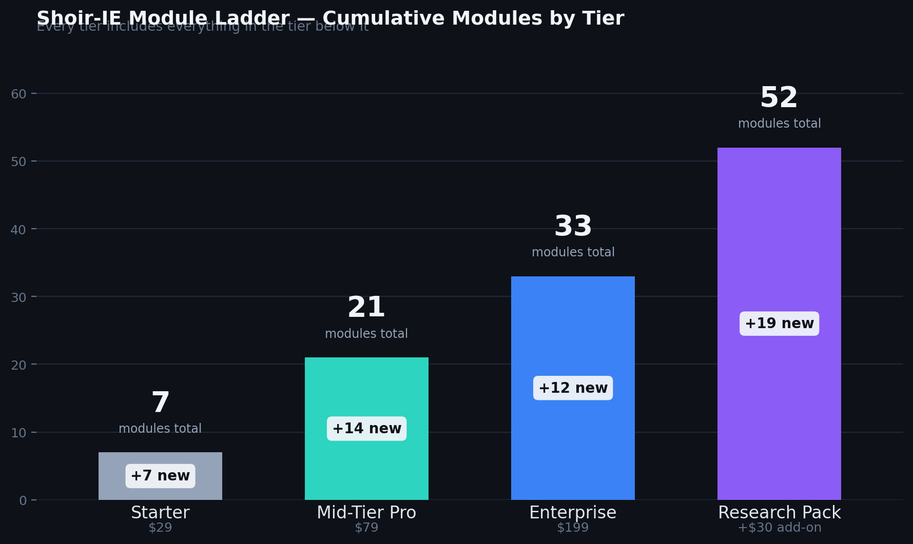
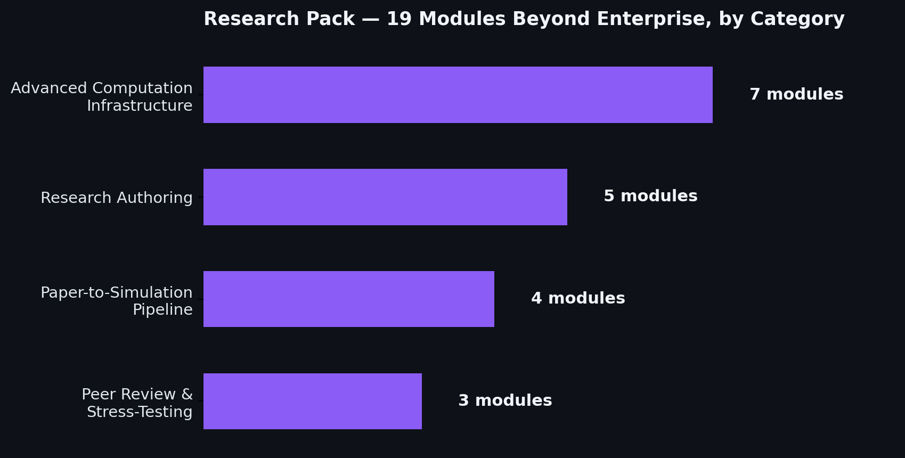
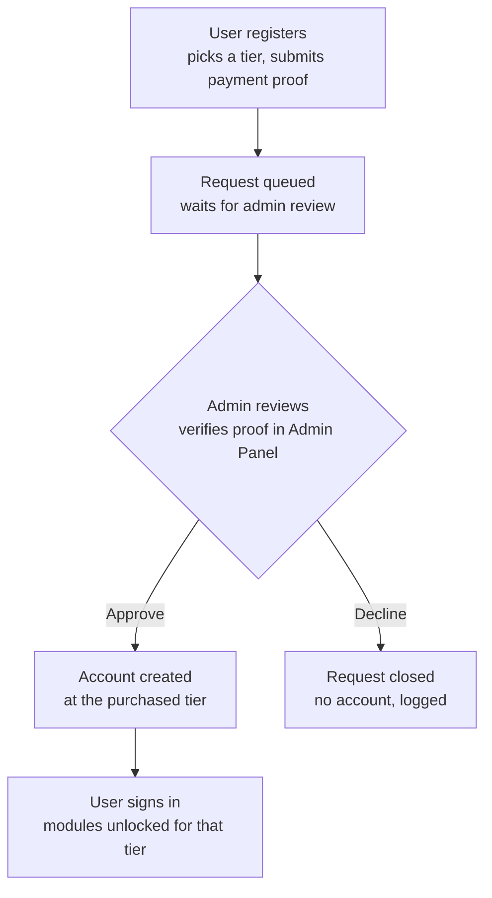
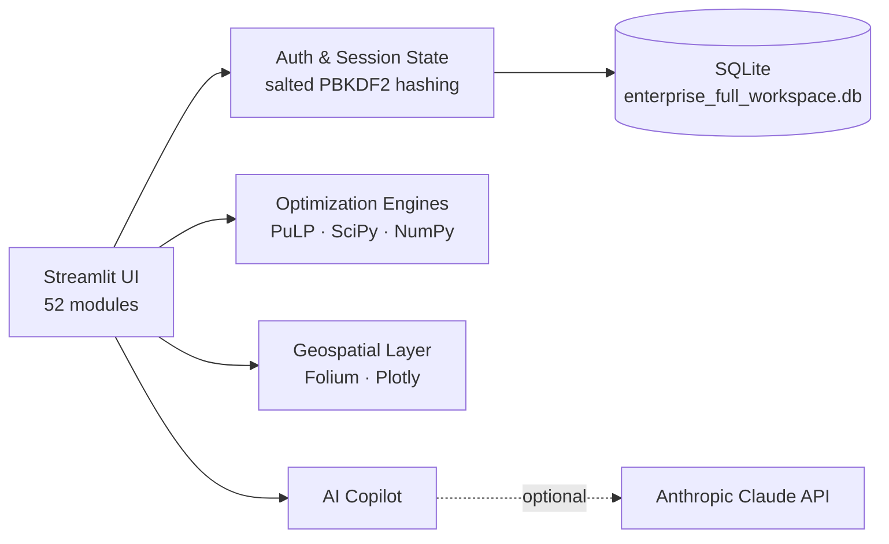

<div align="center">

# ⚡ Shoir-IE

### Deep-Tech Industrial Engineering & Operations Research Platform

**52 modules · 4 tiers · manual-verified subscriptions · a dedicated Research Pack for academic work**

[](https://www.python.org/)
[](https://streamlit.io/)
[](#license)
[](#roadmap)

[Overview](#overview) · [Screenshots](#screenshots) · [Modules & Tiers](#modules--tiers) · [Why It's a Game-Changer](#why-shoir-ie-is-a-game-changer) · [Research Pack](#research-pack) · [Architecture](#architecture) · [Security](#security) · [Getting Started](#getting-started) · [Roadmap](#roadmap)

</div>

---

## Overview

Shoir-IE is a single, connected workspace for industrial engineering and operations-research work — network and inventory optimization, facility layout, quality and reliability, simulation, and a dedicated **Research Pack** for people who need to defend their results to a reviewer, not just present them to a manager.

The problem it solves: IE and OR work is usually scattered across a spreadsheet for EOQ, a separate app for routing, a Six Sigma add-in, a capex spreadsheet, and a stats package for the paper — with nothing connected and nothing reproducible. Shoir-IE puts all of it behind one login, working off one shared, always-current dataset.

| | |
|---|---|
| 🏭 **For operations teams** | Network design, inventory, routing, quality, and production planning in one workspace |
| 🎓 **For researchers** | A Research Pack purpose-built for reproducibility, adversarial peer review, and paper-to-simulation workflows |
| 🔐 **Manually verified accounts** | Every subscription is reviewed by an administrator against real payment proof before activation — no account is ever auto-created |
| 🇸🇦 **Built for the region** | STC Pay integration and Saudi PDPL / E-Commerce Law–aware policies from day one |

---

## Screenshots

> Add real screenshots here before publishing — placeholders below show where they go. A short GIF of the "Explore the Modules" tab, the dashboard, and the Admin Panel review screen make the strongest first impression.

<div align="center">

| Landing & Registration | Dashboard | Admin Review |
|:---:|:---:|:---:|
| `docs/images/landing.png` | `docs/images/dashboard.png` | `docs/images/admin-panel.png` |

</div>

```markdown


```

---

## Modules & Tiers

Every tier is **cumulative** — Mid-Tier Pro includes everything in Starter, Enterprise includes everything in Mid-Tier Pro, and so on.

<div align="center">

</div>

| Tier | Price | Adds | Total modules | Built for |
|---|---|---|---|---|
| **Starter** | $29 | 7 core modules | 7 | Individual analysts replacing spreadsheet-based decisions with solved, optimal answers |
| **Mid-Tier Pro** | $79 | +14 modules | 21 | Teams running day-to-day operations — routing, scheduling, quality, finance |
| **Enterprise** | $199 | +12 modules | 33 | Organizations that need automation, simulation-under-uncertainty, and a natural-language copilot |
| **Research Pack** | +$30 add-on | +19 modules | 52 | Researchers who need reproducibility, adversarial review, and a paper-to-simulation pipeline |

Full documentation for all 52 modules — what each one does, when to use it, and a worked example — is built directly into the app: open the login page and click the **🧭 Explore the Modules** tab. It's not marketing copy; every example maps to a real, running feature.

**A sample of what's inside:**

- **MILP Solvers** — exact optimal warehouse-and-customer network design in seconds, not a week of spreadsheet trial-and-error
- **Monte Carlo Sim** — 10,000-scenario demand simulation instead of one misleadingly-precise point estimate
- **Human Factors & Ergonomics (NIOSH)** — real NIOSH lifting-equation scoring for manual material handling tasks
- **AI Copilot** — ask in plain language ("optimize the network", "check my tier") and get an answer grounded in your real workspace data, not a canned script

---

## Why Shoir-IE Is a Game-Changer

The core shift: work that used to depend on someone's spreadsheet skill, a free afternoon, and a bit of luck now returns a solved, optimal, reproducible answer in the time it takes to click a button. Below is the same set of everyday IE and OR problems, shown as they're typically handled without Shoir-IE versus with it.

| Process | The old way | With Shoir-IE |
|---|---|---|
| Warehouse network design | Days to weeks of manual spreadsheet trial-and-error across a handful of scenarios, with no guarantee the result is actually optimal | **MILP Solvers** returns the mathematically optimal open/close decision in seconds, tested against as many scenarios as you want |
| Safety stock & inventory | Static reorder points set once and rarely revisited; stockouts and overstocks discovered after the fact, in a monthly report | **MEIO Matrix** + **Inventory Playback** recompute optimal buffers across every echelon and surface the exact pattern behind a recurring stockout |
| Vehicle routing | A dispatcher sequences stops by memory and instinct, with no formal optimization behind it | **Fleet Routing** returns an optimized route set with distance and cost per vehicle in seconds |
| Quality control | A run chart eyeballed for "does this look in control" | **Quality Control, Six Sigma & Reliability** returns a real Cpk, control limits, and a numeric verdict |
| Capital investment decisions | A one-off NPV spreadsheet built by whoever's free that week, format different every time | **Engineering Economics & Finance** gives standardized NPV/IRR/payback, the same repeatable way every time |
| Cross-team coordination | Spreadsheets emailed back and forth; someone is always working off yesterday's numbers | **Enterprise Integration & Collaboration** keeps the whole team on one live, shared dataset |
| Reproducing a published model | One to two weeks re-deriving and re-coding a model from a paper by hand | **Paper-to-Simulation Auto-Engine** + **Automated Theory-to-Code Formalizer** turn the paper's model into a runnable starting point directly |
| Pre-submission review | Submit and find out what's wrong when a reviewer rejects it months later | **Adversarial AI Peer-Review Swarm** surfaces weak claims and gaps before you submit, not after |

### What that looks like in practice

**An operations analyst redesigning a distribution network.** The old way: three days pulling demand data into a spreadsheet, manually testing five or six "what if we close this warehouse" scenarios, still not knowing if scenario six would have beaten scenario three. With Shoir-IE: load the same data into **MILP Solvers**, get the exact optimal network in seconds, then run **Sensitivity Analysis** to see which input actually matters and **Carbon Accounting** to see the emissions trade-off — a comparison that used to take days now happens in one sitting, with a mathematically defensible answer instead of "scenario three felt right."

**A quality engineer investigating a defect spike.** The old way: a run chart, a gut feeling about which shift caused it, and a fix based on that guess. With Shoir-IE: feed the same samples into **Quality Control, Six Sigma & Reliability** for a real control chart and Cpk, then use **Lean Manufacturing & Shop Floor Operations** to map the process and find the actual non-value-add step — the guess becomes a number, and the fix targets the real bottleneck instead of the most visible one.

**A graduate researcher preparing a paper for submission.** The old way: weeks of manually re-running statistics, no way to prove the results weren't altered between draft and submission, and finding out about a methodological gap only after a reviewer flags it. With the Research Pack: **Statistical Hypothesis Testing** for a properly-run, citable test, the **Decentralized Cryptographic Reproducibility Vault** to prove nothing was altered after the fact, and the **Adversarial AI Peer-Review Swarm** to catch the gap before a real reviewer does — the paper goes in stronger the first time.

### The compounding effect

Because every tier is cumulative (see the [module ladder above](#modules--tiers)), this isn't a one-off productivity trick on a single task — it's the same connected dataset and the same optimization engines behind every module a team touches. A warehouse decision made in MILP Solvers is visible to whoever runs Carbon Accounting or Scenarios five minutes later, without anyone re-entering a number. That's the real shift: from a pile of disconnected one-off tools each solving one problem, to one workspace where solving one problem makes the next one easier.

---

## Research Pack

The Research Pack is Shoir-IE's sharpest differentiator: a genuinely research-grade layer most industrial-engineering software doesn't attempt — statistics, reproducibility, adversarial review, and a full paper-to-simulation pipeline.

<div align="center">

</div>

**Why it exists:** there's a real gap between "I have a model" and "I have a submittable, defensible, reproducible result." The Research Pack is built to close exactly that gap:

- **Statistical Hypothesis Testing** → run a proper t-test/ANOVA/chi-square with real statistics, ready to cite, instead of a claimed result
- **Paper-to-Simulation Auto-Engine** → point it at a published model and get a runnable simulation of it, turning a week of re-implementation into a starting point
- **Adversarial AI Peer-Review Swarm** → get your methodology critiqued before a real reviewer does, catching weak claims before submission instead of after rejection
- **Decentralized Cryptographic Reproducibility Vault** → cryptographically prove your published results came from the exact code and data you say they did, months or years later

---

## Architecture

### Registration → Verification → Access

Every account is manually verified against real payment proof before activation — the platform never auto-creates a paid account.



### System overview



---

## Security

- **Salted, hashed passwords** — PBKDF2-HMAC-SHA256, 200,000 iterations. Nothing is ever stored in plain text, including the admin account.
- **Database-backed login rate limiting** — 5 failed attempts locks a username out for 10 minutes; can't be bypassed by opening a new tab.
- **Input validation at the point of entry** — usernames and emails are format-checked at registration, closing a stored-XSS gap at the source rather than patching every place a name is later displayed.
- **Secrets kept out of source** — admin credentials and email/API keys read from `st.secrets`, never hardcoded.
- **Full audit trail** — every admin action (approve, decline, manual code generation) is logged with a timestamp and actor.
- **Role-gated admin panel** — the pending-request review screen, user list, and audit log are reachable only by the authenticated admin account, nowhere else in the app.

## Compliance

Privacy Policy, Terms & Conditions, Cookie Policy, and Refund Policy are built directly into the registration flow, with a real consent checkbox — not an afterthought page nobody reads. Drafted specifically around what this app actually collects (reviewed against Saudi PDPL and E-Commerce Law considerations, given STC Pay as the payment method).

---

## Getting Started

### Prerequisites
- Python 3.10+
- pip

### Installation

```bash
git clone <your-repo-url>
cd shoir-ie
pip install -r requirements.txt
```

### Configuration

Create `.streamlit/secrets.toml`:

```toml
[email]
sender_email = "your-notification-email@gmail.com"
app_password = "your-app-password"

[admin]
password = "set-a-strong-admin-password-here"

# Optional — connects the AI Copilot to a real language model.
# Without this, the Copilot still works using real workspace data,
# just without open-ended natural-language reasoning.
[anthropic]
api_key = "your-anthropic-api-key"
```

### Run

```bash
streamlit run app.py
```

Sign in with the admin account configured above to reach the Admin Panel and start approving registrations.

> ⚠️ **Before deploying publicly:** this app currently stores its database and uploaded payment proofs on local disk. Streamlit Community Cloud does not guarantee persistence of local files — a redeploy or restart can wipe all accounts, including the admin account. Migrate to a hosted database (e.g. Supabase or Neon Postgres) before relying on a public deployment.

---

## Tech Stack

| Layer | Technology |
|---|---|
| App framework | Streamlit |
| Optimization | PuLP (MILP), SciPy, NumPy |
| Data | Pandas, SQLite |
| Visualization | Plotly, Folium |
| AI Copilot | Rule-based by default; optional Anthropic Claude API |
| Auth | Salted PBKDF2 password hashing, database-backed rate limiting |

---

## Roadmap

Honest, in priority order:

- [ ] **Migrate off local SQLite** to a hosted Postgres database — required before any public deployment
- [ ] **Public demo / auto-approved trial tier** — so evaluators can try the platform without waiting on manual approval
- [ ] Guided first-run onboarding for new accounts
- [ ] Consistent CSV/PDF export with charts across all 52 modules
- [ ] Automated test coverage and CI
- [ ] Modularize the codebase out of a single file

---

## License

Proprietary — © 2026 Shoir-IE. All rights reserved.

## Contact

**shoirtheagent@gmail.com**
