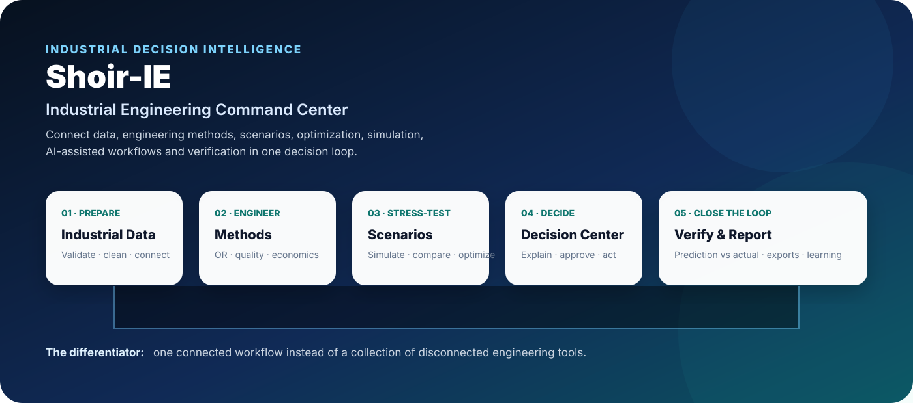

# ⚡ Shoir-IE

### **Industrial Engineering Command Center & Decision Intelligence Platform**

**From fragmented industrial analysis to connected engineering decisions.**

   

**Data → Model → Engineering → Scenario → Decision → Verification → Report**

---

## 🏆 The one-minute story

Industrial engineering already has powerful mathematics, optimization, simulation, quality, planning and analytics. The difficult part is often everything around the mathematics: cleaning data, rebuilding models, copying assumptions, testing scenarios, explaining results, creating reports and later verifying what actually happened.

**Shoir-IE is built to connect that workflow.**

> ### The goal
> Spend less time moving engineering work between disconnected tools, and more time solving the industrial problem.

---

## 🎯 The transformation

### Traditional workflow

~~~text
Excel → manual cleanup → separate model → copied scenarios → manual charts → manual report → decision
~~~

### Shoir-IE workflow

~~~text
Industrial Data
      ↓
Validation & Cleaning
      ↓
Shared Industrial Model / Digital Thread
      ↓
Engineering Methods
      ↓
Optimization + Simulation + Analytics
      ↓
Scenario + Sensitivity
      ↓
Decision Center
      ↓
Verification
      ↓
Technical + Executive Export
      ↺
Learning / Improvement
~~~

The differentiator is **integration and traceability**, not simply the number of modules.

---

## 🚀 Capability map

| Domain | Representative capabilities |
|---|---|
| **Operations Research** | MILP, network/assignment workflows, robust optimization, multi-objective optimization |
| **Supply Chain** | Inventory, MEIO, supplier risk, fleet routing, network design, warehouse analysis |
| **Production** | PPC, APS, lean/shop-floor workflows, MES foundations |
| **Quality & Reliability** | SPC, Six Sigma, capability, quality engineering and reliability workflows |
| **Simulation & Risk** | Monte Carlo, sensitivity, discrete-event/digital-twin foundations, experiment workflows |
| **Facilities** | Layout, warehousing, travel analysis, 3D factory foundations |
| **Workforce** | Staffing, work measurement, ergonomics, human factors and balance |
| **Economics** | NPV, IRR, payback, CAPEX/OPEX and investment analysis |
| **Sustainability** | Carbon, Green IE, LCA and sustainability-oriented engineering |
| **Digital Thread** | Products, customers, suppliers, facilities, machines, people, materials, routes and orders |
| **Connectivity** | IoT/digital-twin and integration foundations |
| **Decision Intelligence** | Scenarios, versioning, control-tower concepts, decision center and verification |
| **AI** | Copilot, recommendations and agentic workflow foundations |
| **Research** | Statistics, regression, paper-to-simulation, reproducibility and advanced research workflows |
| **Reporting** | Executive reporting, Excel-oriented outputs and evidence-oriented exports |

> **Repository truth matters:** capability names above reflect the current application catalogue. Live connectors, enterprise integrations and deployment behavior can depend on environment configuration.

---

## 🏗️ Platform architecture

~~~text
Engineer / Planner / Manager / Researcher
                    ↓
             Shoir-IE Workspace
                    ↓
       Industrial Data Model / Thread
                    ↓
   ┌─────────┬─────────┬─────────┬─────────┐
   ↓         ↓         ↓         ↓         ↓
Methods   Optimize  Simulate   Quality  Economics
   │         │         │         │         │
   └─────────┴─────────┴─────────┴─────────┘
                    ↓
           Scenario / Sensitivity
                    ↓
             Decision Center
                    ↓
          Verification / Governance
                    ↓
          Executive + Technical Export
                    ↺
              Actual Outcomes
~~~

---

## 🔄 The digital decision loop

**01 · Prepare** — import and validate operational data.

**02 · Model** — represent the industrial system, entities and assumptions.

**03 · Engineer** — apply the appropriate IE, OR, quality, reliability or economic method.

**04 · Stress-test** — vary assumptions, uncertainty and operating conditions.

**05 · Decide** — expose trade-offs, drivers, assumptions and evidence.

**06 · Execute** — use the result as the basis for the operational decision.

**07 · Verify** — compare expected outcomes with actual outcomes.

**08 · Learn** — feed verified outcomes back into future engineering work.

---

## 🤖 Copilot AI

The Copilot is designed as the natural-language entry point into the platform, while keeping engineering assumptions and user control visible.

Example requests:

- “Compare these scenarios.”
- “Which engineering method fits this problem?”
- “Check this process for drift.”
- “Analyze this investment case.”
- “Prepare the executive output.”

Intended workflow:

~~~text
Natural-language request
        ↓
Engineering intent
        ↓
Relevant capability
        ↓
Workspace context
        ↓
Proposed / executed workflow
        ↓
Evidence + assumptions
        ↓
Result + export / next action
~~~

---

## 🧩 Capability tiers

| Tier | Focus |
|---|---|
| **Starter** | Core IE, MILP, inventory, facility/layout, persistence, validation and Excel/data-cleaning foundations |
| **Mid-Tier Pro** | Carbon, IoT/digital-twin foundations, MEIO, slotting/Gantt, routing, warehouse analytics, supplier risk, scenarios, AGV, geospatial design, PPC, lean, quality, economics and the Industrial Data Model |
| **Professional** | APS, advanced quality/reliability, capital investment, workforce engineering, sustainability/LCA, benchmarking, scenario versioning and localization |
| **Enterprise** | Copilot, API gateway, Monte Carlo, sensitivity, alerts, agentic workflows, control tower, predictive maintenance, human factors, DES/digital twin, MES foundations, simulation lab, 3D factory, connectivity, robust/multi-objective optimization, model registry, experiments, decision center, ML forecasting, workspaces/RBAC and executive reporting |
| **Enterprise Plus** | Industrial Data Platform, Advanced Engineering Copilot, Live Industrial Digital Twin, Enterprise Security & Governance and Predictive Maintenance Digital Twin |
| **Research Pack** | Statistical testing, LaTeX, literature/citation workflows, advanced regression, reproducible papers, paper-to-simulation, adversarial review/stress testing, formalization and advanced computation experiments |

---

## 📊 Results-first UX

Shoir-IE is designed so users see the engineering result before implementation details.

~~~text
ENGINEERING RESULT
        ↓
KPI + PRIMARY GRAPH
        ↓
Key drivers / findings
        ↓
Assumptions / constraints / uncertainty
        ↓
Download / Compare / Save Scenario
        ↓
Advanced diagnostics
~~~

This serves both the engineer who needs depth and the manager who needs a clear decision view.

---

## 📈 Measuring real-world value

Shoir-IE deliberately avoids unsupported universal savings percentages. Value should be measured against an organization's baseline.

| Value driver | Baseline | Post-deployment measure |
|---|---|---|
| Data preparation | Analyst hours/study | Hours/study |
| Scenario analysis | Scenarios/cycle | Scenarios/cycle |
| Reporting | Hours/report | Hours/report |
| Rework | Corrections/revisions | Corrections/revisions |
| Planning | Planning-cycle duration | Cycle duration |
| Inventory | Inventory + service | Inventory + service |
| Logistics | Distance / transport cost | Distance / transport cost |
| Quality | Scrap / FPY / capability | Scrap / FPY / capability |
| Energy | kWh/unit | kWh/unit |
| Carbon | tCO₂e/unit | tCO₂e/unit |
| Model accuracy | Prediction vs actual | Error after implementation |

The intended value mechanism is **less duplicated work + faster scenario analysis + better traceability + more repeatable reporting + earlier risk visibility**. Actual impact depends on data, process, integrations, adoption and decisions.

---

## 🏭 Competition-ready demonstration

Do not present Shoir-IE as a tour of buttons. Present one industrial problem from start to finish.

### A strong 7-minute storyline

**0:00 — Problem:** show the fragmented workflow.

**0:45 — Innovation:** introduce the connected decision loop.

**1:30 — Data:** import and validate a realistic industrial dataset.

**2:15 — Engineering:** build the model and run the appropriate method.

**3:15 — Uncertainty:** run scenarios, sensitivity or simulation.

**4:15 — Decision:** compare alternatives with clear KPIs and graphs.

**5:15 — Explain:** show drivers, assumptions and evidence.

**6:00 — Verify + export:** show the decision record and executive result.

**6:40 — Vision:** close on the connected engineering loop.

> **One industrial question. One connected workflow. One evidence trail.**

---

## 🔬 Research & advanced engineering

The Research Pack extends Shoir-IE into a reproducible engineering-research workflow:

~~~text
Research Question → Model → Data → Experiment → Simulation
       → Statistical Analysis → Stress Test → Reproducibility → Paper
~~~

Representative capabilities include statistical hypothesis testing, advanced regression, literature/citation matrices, LaTeX formatting, reproducible paper workflows, paper-to-simulation concepts, theory-to-code formalization, adversarial review, chaos/shock injection, synthetic industrial twins, surrogate modeling and reproducibility infrastructure.

These capabilities support experimentation and inspection; they do not replace independent academic review.

---

## 📤 Reporting & exports

Engineering work should leave the application as a reusable artifact.

Supported workflows include:

- Excel-oriented analysis workbooks
- multi-sheet analysis packages
- scenario comparison outputs
- charts and analytical tables
- simulation results
- quality/reliability outputs
- decision-verification records
- executive reporting workflows

> **Run the study once → preserve the result → reuse the evidence → export the story.**

---

## 🛡️ Validation & quality philosophy

A polished engineering platform should not merely produce a number. It should help answer:

- **Can I trust the input?** — data quality, validation and assumptions.
- **Can I trust the model?** — constraints, diagnostics and reproducibility.
- **Can I understand the result?** — charts, drivers and sensitivity.
- **Can I reproduce it?** — persisted scenarios, context and exports.
- **Can I verify it later?** — decision verification and audit-oriented records.

The GitHub Actions validation chain is designed to cover dependency installation, Python compilation, pytest, application smoke checks, module-surface regression checks and Streamlit startup behavior.

> **Important:** code changes alone are not proof of perfect runtime behavior. Automated validation and real deployment testing are part of the product-development loop.

---

## 🔐 Security & governance foundation

The repository includes foundations for salted PBKDF2 password hashing, login-attempt throttling, role/tier controls, audit infrastructure, guarded formula evaluation, scenario lineage/versioning, decision-verification persistence and environment-based secrets.

For production enterprise deployment, environment-specific hardening remains necessary: database operations, secret rotation, backups, monitoring, network policy, identity integration and connector security.

---

## 🗺️ Roadmap

- [ ] Expand end-to-end browser interaction regression testing
- [ ] Deepen cross-module Digital Thread propagation
- [ ] Production-grade PostgreSQL deployment path
- [ ] Broader ERP/MES/SCADA connector validation
- [ ] Stronger APS ↔ MES ↔ Quality feedback loops
- [ ] Deeper live digital-twin synchronization and calibration
- [ ] Expanded model registry and experiment lineage
- [ ] More advanced executive-report automation
- [ ] Guided study templates and onboarding
- [ ] Production observability and deployment hardening
- [ ] Real-world benchmark and case-study library
- [ ] Broader automated visual/regression testing

---

## 🛠️ Quick start

### Requirements

- Python 3.10+
- pip
- supported Streamlit environment

### Install

~~~bash
git clone https://github.com/MSJ1708/shoir-ie.git
cd shoir-ie
python -m pip install -r requirements.txt
~~~

### Run

~~~bash
streamlit run app.py
~~~

Use deployment secrets/environment variables for credentials and API keys. Never commit real passwords, API keys, payment credentials or other secrets to Git.

---

## 📁 Repository map

~~~text
shoir-ie/
├── app.py
├── industrial_platform.py
├── industrial_platform_excellence.py
├── industrial_operating_system.py
├── shoir_upgrade.py
├── aegis_opt.py
├── aegis_sim.py
├── enterprise_engine.py
├── database.py
├── pages/
├── tests/
├── docs/
└── .github/workflows/
~~~

---

## 📌 Project status

**Active development.**

Shoir-IE has a broad implemented application surface and automated validation infrastructure. Production readiness is a separate engineering milestone from feature completeness and should be evaluated against the target deployment environment, data sources, security requirements and real workloads.

> **The objective is not to claim perfection. The objective is to build a system that can continuously prove it is improving.**

---

## 🌍 Vision

~~~text
DATA
  ↓
DIGITAL THREAD
  ↓
ENGINEERING
  ↓
OPTIMIZATION + SIMULATION + AI
  ↓
DECISION
  ↓
EXECUTION
  ↓
MEASUREMENT
  ↓
VERIFICATION
  ↓
LEARNING
  ↺
~~~

The destination is not simply a larger collection of tools. It is an environment where an industrial team can move from **the problem**, to **the model**, to **the scenarios**, to **the evidence**, to **the decision**, and finally to **what actually happened**.

That is the foundation of the Shoir-IE Industrial Engineering Command Center vision.

---

## 📜 License

**Proprietary — © 2026 Shoir-IE. All rights reserved.**

See [LICENSE](LICENSE).

---

## ⚡ Shoir-IE

### **Connect the data. Engineer the system. Test the decision. Verify the outcome.**

**Industrial Engineering · Operations Research · Simulation · Optimization · Quality · Reliability · Sustainability · AI · Decision Intelligence**

[View Repository](https://github.com/MSJ1708/shoir-ie) · [View Validation](https://github.com/MSJ1708/shoir-ie/actions) · [Contact](mailto:shoirtheagent@gmail.com)

