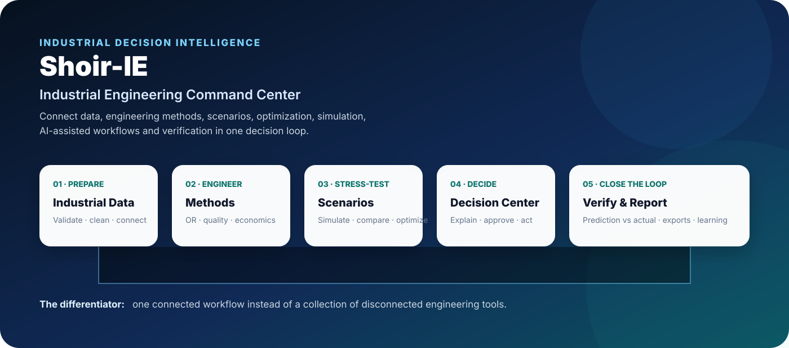

# ⚡ Shoir-IE

### **Industrial Engineering Command Center & Decision Intelligence Platform**

**From fragmented industrial analysis to connected engineering decisions.**

   

**Data → Model → Engineering → Scenario → Decision → Verification → Report**

---

## 🏆 The one-minute story

Industrial engineering already has powerful mathematics, optimization, simulation, quality, planning and analytics. The difficult part is often everything around the mathematics: cleaning data, rebuilding models, copying assumptions, testing scenarios, explaining results, creating reports and later verifying what actually happened.

**Shoir-IE is built to connect that workflow.**

> ### The goal
> Spend less time moving engineering work between disconnected tools, and more time solving the industrial problem.

---

## 🎯 The transformation

### Traditional workflow

~~~text
Excel → manual cleanup → separate model → copied scenarios → manual charts → manual report → decision
~~~

### Shoir-IE workflow

~~~text
Industrial Data
      ↓
Validation & Cleaning
      ↓
Shared Industrial Model / Digital Thread
      ↓
Engineering Methods
      ↓
Optimization + Simulation + Analytics
      ↓
Scenario + Sensitivity
      ↓
Decision Center
      ↓
Verification
      ↓
Technical + Executive Export
      ↺
Learning / Improvement
~~~

The differentiator is **integration and traceability**, not simply the number of modules.

---

## 🚀 Capability map

| Domain | Representative capabilities |
|---|---|
| **Operations Research** | MILP, network/assignment workflows, robust optimization, multi-objective optimization |
| **Supply Chain** | Inventory, MEIO, supplier risk, fleet routing, network design, warehouse analysis |
| **Production** | PPC, APS, lean/shop-floor workflows, MES foundations |
| **Quality & Reliability** | SPC, Six Sigma, capability, quality engineering and reliability workflows |
| **Simulation & Risk** | Monte Carlo, sensitivity, discrete-event/digital-twin foundations, experiment workflows |
| **Facilities** | Layout, warehousing, travel analysis, 3D factory foundations |
| **Workforce** | Staffing, work measurement, ergonomics, human factors and balance |
| **Economics** | NPV, IRR, payback, CAPEX/OPEX and investment analysis |
| **Sustainability** | Carbon, Green IE, LCA and sustainability-oriented engineering |
| **Digital Thread** | Products, customers, suppliers, facilities, machines, people, materials, routes and orders |
| **Connectivity** | IoT/digital-twin and integration foundations |
| **Decision Intelligence** | Scenarios, versioning, control-tower concepts, decision center and verification |
| **AI** | Copilot, recommendations and agentic workflow foundations |
| **Research** | Statistics, regression, paper-to-simulation, reproducibility and advanced research workflows |
| **Reporting** | Executive reporting, Excel-oriented outputs and evidence-oriented exports |

> **Repository truth matters:** capability names above reflect the current application catalogue. Live connectors, enterprise integrations and deployment behavior can depend on environment configuration.

---

## 🏗️ Platform architecture

~~~text
Engineer / Planner / Manager / Researcher
                    ↓
             Shoir-IE Workspace
                    ↓
       Industrial Data Model / Thread
                    ↓
   ┌─────────┬─────────┬─────────┬─────────┐
   ↓         ↓         ↓         ↓         ↓
Methods   Optimize  Simulate   Quality  Economics
   │         │         │         │         │
   └─────────┴─────────┴─────────┴─────────┘
                    ↓
           Scenario / Sensitivity
                    ↓
             Decision Center
                    ↓
          Verification / Governance
                    ↓
          Executive + Technical Export
                    ↺
              Actual Outcomes
~~~

---

## 🔄 The digital decision loop

**01 · Prepare** — import and validate operational data.

**02 · Model** — represent the industrial system, entities and assumptions.

**03 · Engineer** — apply the appropriate IE, OR, quality, reliability or economic method.

**04 · Stress-test** — vary assumptions, uncertainty and operating conditions.

**05 · Decide** — expose trade-offs, drivers, assumptions and evidence.

**06 · Execute** — use the result as the basis for the operational decision.

**07 · Verify** — compare expected outcomes with actual outcomes.

**08 · Learn** — feed verified outcomes back into future engineering work.

---

## 🤖 Copilot AI

The Copilot is designed as the natural-language entry point into the platform, while keeping engineering assumptions and user control visible.

Example requests:

- “Compare these scenarios.”
- “Which engineering method fits this problem?”
- “Check this process for drift.”
- “Analyze this investment case.”
- “Prepare the executive output.”

Intended workflow:

~~~text
Natural-language request
        ↓
Engineering intent
        ↓
Relevant capability
        ↓
Workspace context
        ↓
Proposed / executed workflow
        ↓
Evidence + assumptions
        ↓
Result + export / next action
~~~

---

## 🧩 Capability tiers

| Tier | Focus |
|---|---|
| **Starter** | Core IE, MILP, inventory, facility/layout, persistence, validation and Excel/data-cleaning foundations |
| **Mid-Tier Pro** | Carbon, IoT/digital-twin foundations, MEIO, slotting/Gantt, routing, warehouse analytics, supplier risk, scenarios, AGV, geospatial design, PPC, lean, quality, economics and the Industrial Data Model |
| **Professional** | APS, advanced quality/reliability, capital investment, workforce engineering, sustainability/LCA, benchmarking, scenario versioning and localization |
| **Enterprise** | Copilot, API gateway, Monte Carlo, sensitivity, alerts, agentic workflows, control tower, predictive maintenance, human factors, DES/digital twin, MES foundations, simulation lab, 3D factory, connectivity, robust/multi-objective optimization, model registry, experiments, decision center, ML forecasting, workspaces/RBAC and executive reporting |
| **Enterprise Plus** | Industrial Data Platform, Advanced Engineering Copilot, Live Industrial Digital Twin, Enterprise Security & Governance and Predictive Maintenance Digital Twin |
| **Research Pack** | Statistical testing, LaTeX, literature/citation workflows, advanced regression, reproducible papers, paper-to-simulation, adversarial review/stress testing, formalization and advanced computation experiments |

---

## 📊 Results-first UX

Shoir-IE is designed so users see the engineering result before implementation details.

~~~text
ENGINEERING RESULT
        ↓
KPI + PRIMARY GRAPH
        ↓
Key drivers / findings
        ↓
Assumptions / constraints / uncertainty
        ↓
Download / Compare / Save Scenario
        ↓
Advanced diagnostics
~~~

This serves both the engineer who needs depth and the manager who needs a clear decision view.

---

## 📈 Measuring real-world value

Shoir-IE deliberately avoids unsupported universal savings percentages. Value should be measured against an organization's baseline.

| Value driver | Baseline | Post-deployment measure |
|---|---|---|
| Data preparation | Analyst hours/study | Hours/study |
| Scenario analysis | Scenarios/cycle | Scenarios/cycle |
| Reporting | Hours/report | Hours/report |
| Rework | Corrections/revisions | Corrections/revisions |
| Planning | Planning-cycle duration | Cycle duration |
| Inventory | Inventory + service | Inventory + service |
| Logistics | Distance / transport cost | Distance / transport cost |
| Quality | Scrap / FPY / capability | Scrap / FPY / capability |
| Energy | kWh/unit | kWh/unit |
| Carbon | tCO₂e/unit | tCO₂e/unit |
| Model accuracy | Prediction vs actual | Error after implementation |

The intended value mechanism is **less duplicated work + faster scenario analysis + better traceability + more repeatable reporting + earlier risk visibility**. Actual impact depends on data, process, integrations, adoption and decisions.

---

## 🏭 Competition-ready demonstration

Do not present Shoir-IE as a tour of buttons. Present one industrial problem from start to finish.

### A strong 7-minute storyline

**0:00 — Problem:** show the fragmented workflow.

**0:45 — Innovation:** introduce the connected decision loop.

**1:30 — Data:** import and validate a realistic industrial dataset.

**2:15 — Engineering:** build the model and run the appropriate method.

**3:15 — Uncertainty:** run scenarios, sensitivity or simulation.

**4:15 — Decision:** compare alternatives with clear KPIs and graphs.

**5:15 — Explain:** show drivers, assumptions and evidence.

**6:00 — Verify + export:** show the decision record and executive result.

**6:40 — Vision:** close on the connected engineering loop.

> **One industrial question. One connected workflow. One evidence trail.**

---

## 💼 Investor & Incubator Overview

# Shoir-IE — Industrial Engineering Operating System

### **From Industrial Data to Verified Decisions**

Shoir-IE is a unified industrial engineering and decision-intelligence platform designed to connect the work that is traditionally distributed across spreadsheets, engineering calculations, optimization tools, simulation environments, quality systems and management reports.

`Industrial Data → Data Intelligence → Industrial Engineering → Scenario Intelligence → Decision → Verification → Business Value`

The platform brings industrial engineering disciplines into one connected environment while creating a foundation for AI-assisted analysis, digital-thread traceability, industrial simulation, optimization and measurable value creation.

> **Shoir-IE turns industrial complexity into an executable decision workflow.**

---

## 🌍 The Opportunity

Industrial organizations do not lack data, formulas or specialist software. The larger opportunity is the fragmented workflow between them.

A typical improvement project can span:

`Excel → Manual Cleaning → Separate Analysis → Model Rebuild → Scenario Copies → Charts → Report → Review → Revision`

Shoir-IE is designed to compress that workflow into:

`Import → Validate → Model → Analyze → Simulate → Optimize → Compare → Decide → Verify`

This creates a large and repeatable software opportunity across manufacturing, logistics, supply chain, quality, reliability, facilities, workforce, energy and sustainability.

NIST has estimated interoperability-related costs associated with varying data formats at **$20.9B–$42.9B in U.S. discrete manufacturing**, while identifying additional value associated with better digital information flows.  
[Source: NIST](https://www.nist.gov/news-events/news/2020/02/inadequate-modeling-data-costs-billions-us-manufacturers)

Downtime represents another significant industrial value pool. Siemens' 2024 research reported an automotive-sector benchmark of **$2.3M per unproductive hour** among surveyed manufacturers.  
[Source: Siemens — Total Cost of Downtime](https://assets.new.siemens.com/siemens/assets/api/uuid%3A1b43afb5-2d07-47f7-9eb7-893fe7d0bc59/TCOD-2024_original.pdf)

---

## ⚡ The Shoir-IE Advantage

### One platform. One industrial context. One decision trail.

Shoir-IE connects:

| Capability | Platform value |
|---|---|
| **Industrial Data Intelligence** | Import, clean, validate, map and activate industrial datasets |
| **Industrial Workbook** | Reusable inputs, calculations, KPIs, scenarios and decision context |
| **Operations Research** | Optimization, MILP, assignment, routing, network and scheduling workflows |
| **Production Engineering** | Capacity, PPC, line balance, lean and shop-floor analysis |
| **Supply Chain** | Inventory, MEIO, supplier risk, network design, routing and warehouse analytics |
| **Quality & Reliability** | SPC, capability, Six Sigma, reliability and quality-engineering workflows |
| **Facilities** | Layout, material flow, From/To, SLP and route what-if analysis |
| **Workforce Engineering** | Staffing, work measurement, ergonomics and balance analysis |
| **Simulation & Risk** | Monte Carlo, sensitivity, experiments and digital-twin foundations |
| **Economics** | NPV, IRR, payback, CAPEX/OPEX and investment analysis |
| **Sustainability** | Energy, carbon, Green IE, LCA and resource-efficiency workflows |
| **Digital Thread** | Shared industrial context connecting assets, processes, products, materials and outcomes |
| **AI Copilot** | Natural-language access to industrial analysis and engineering workflows |
| **Decision Intelligence** | Scenarios, comparisons, evidence, decisions and verification |
| **Reporting** | Executive-ready outputs, analytical workbooks and evidence packages |

The differentiation is not the number of individual tools. It is the **connected workflow across them**.

---

## 🧠 The Industrial Decision Engine

The core product loop is:

`DATA`
↓  
`VALIDATE`
↓  
`MODEL`
↓  
`ENGINEER`
↓  
`SIMULATE / OPTIMIZE`
↓  
`COMPARE`
↓  
`DECIDE`
↓  
`IMPLEMENT`
↓  
`MEASURE`
↓  
`VERIFY`
↓  
`LEARN`

Each completed study can become reusable organizational intelligence rather than a one-time analysis.

### Digital Thread

`Asset → Process → Product → Material → Order → Workforce → Quality → Maintenance → Energy → Cost → Scenario → Decision → Outcome`

The Digital Thread creates the foundation for connecting operational reality with engineering models and management decisions.

---

## 💼 The Commercialization Platform

The next product layer extends Shoir-IE from an engineering platform into a complete industrial innovation and commercialization environment.

### Customer & Stakeholder Hub

A structured customer intelligence layer connects the technical solution to the people and organizations that use, fund, adopt or benefit from it.

`Customer → Problem → Workflow → Evidence → Requirement → Pilot → Adoption`

Core records include:

- target customer and end user;
- beneficiary and adopting organization;
- problem statement;
- current workflow and workaround;
- stakeholder map;
- process time and cost;
- pain frequency and severity;
- error burden;
- adoption pathway;
- objections;
- requested capabilities;
- engagement history;
- pilot status.

### Pilot Manager

`Discovery → Baseline → Pilot Setup → Deployment → Measurement → Feedback → Decision`

Pilot execution becomes a structured product capability rather than a separate consulting process.

---

## 🔬 Hypothesis → Evidence

Shoir-IE is extending its decision architecture with a first-class evidence model:

`Hypothesis → Metric → Baseline → Experiment → Result → Evidence → Decision`

The same evidence structure can support:

**industrial studies, customer discovery, pilot measurements, experiments, simulations, optimization studies, research projects and business cases.**

This creates a persistent bridge between **what is believed, what was measured and what was decided**.

---

## 💰 Value Evidence Engine

Shoir-IE converts engineering improvement into measurable business value.

### Time value

`Hours Saved = Baseline Study Time − Shoir-IE Study Time`

`Annual Capacity Released = Hours Saved × Studies Per Year`

### Financial value

`Verified Economic Benefit = Baseline Cost − Post-Deployment Cost − Implementation Cost`

### Industrial value metrics

**Engineering Hours**

**Planning-Cycle Time**

**Scenario Turnaround**

**Report-Production Time**

**Data-Quality Defects**

**Rework Cycles**

**Inventory Impact**

**Transport Distance / Cost**

**Scrap & Rework Value**

**Downtime Exposure**

**Energy Consumption**

**Carbon Impact**

**ROI**

**Payback**

The value engine is designed around customer-specific baselines so that financial impact is linked to measurable industrial conditions.

---

## 🗂️ Investor Data Room

A dedicated Investor Data Room creates a structured evidence package around the venture:

`Product → Problem → Market → Customer Evidence → Pilots → ROI → Traction → Security → Financial Model → Roadmap`

The data architecture supports:

- controlled evidence;
- source links;
- timestamps;
- confidence metadata;
- version history;
- pilot records;
- product milestones;
- commercial metrics;
- financial assumptions;
- customer evidence.

This turns product development into a continuously updated **investment evidence system**.

---

## 📈 Product-Market-Fit & Readiness Intelligence

A unified readiness layer connects technical development with commercial execution.

| Dimension | Platform view |
|---|---|
| **Problem Validation** | Documented industrial problem and evidence |
| **ICP** | Target customer and use-case definition |
| **MVP** | Product capability readiness |
| **Data Readiness** | Quality, structure and accessibility |
| **Deployment Readiness** | Operational implementation readiness |
| **Security** | Governance and access readiness |
| **Pilot Readiness** | Ability to execute measurable proofs of value |
| **Customer Evidence** | Discovery, feedback and pilot records |
| **Commercial Evidence** | Adoption and willingness-to-pay signals |
| **Repeatability** | Templates, workflows and reusable deployment patterns |
| **Adoption** | Expansion across teams, sites and use cases |

---

## 📊 Product & Traction Intelligence

Platform analytics create a continuous product-learning loop:

`Usage → Insight → Product Improvement → Customer Value → Adoption`

Key measures include:

- active workspaces;
- studies created;
- datasets activated;
- analyses executed;
- scenarios compared;
- reports exported;
- time-to-first-result;
- repeat usage;
- pilot conversion;
- feature adoption.

These metrics provide the foundation for product-led growth, customer success and commercial forecasting.

---

## 🎬 Executive Demo Mode

Shoir-IE is designed to deliver a deterministic, executive-quality product demonstration from a single industrial scenario.

### The flagship journey

`Raw Excel`
→ `Data Quality`
→ `Industrial Workbook`
→ `Facility / Material Flow`
→ `Engineering Analysis`
→ `Scenario Comparison`
→ `Optimization / Simulation`
→ `Decision`
→ `ROI`
→ `Executive Report`

### Seven-minute investor experience

| Time | Experience |
|---|---|
| **0:00–0:45** | Industrial problem and fragmented workflow |
| **0:45–1:30** | Raw Excel import, discovery, validation and cleaning |
| **1:30–2:20** | Industrial Workbook and reusable engineering context |
| **2:20–3:20** | Facility, material flow and route what-if |
| **3:20–4:20** | One focused engineering analysis |
| **4:20–5:20** | Baseline vs alternative scenarios |
| **5:20–6:10** | Evidence, assumptions and decision trace |
| **6:10–7:00** | Value, ROI and executive output |

### The presentation principle

> **One industrial problem. One connected workflow. One evidence trail.**

---

## 🏭 Flagship Use Case: Factory Performance

A representative factory workflow demonstrates the complete value chain:

`Industrial Workbook`
↓
`Data Intelligence`
↓
`Facility & Material Flow`
↓
`Capacity / Production Analysis`
↓
`Scenario Laboratory`
↓
`Optimization / Simulation`
↓
`Decision Center`
↓
`Value Evidence`
↓
`Verification`

A single industrial question can therefore move from raw operational data to a quantified decision without rebuilding the analysis across disconnected applications.

---

## 🦺 Safety, Quality & Risk Intelligence

Shoir-IE extends the same architecture into operational risk:

`Hazard → Task → Process → Location → Exposure → Risk → Control → Incident / Near Miss → Corrective Action → Verification`

The safety and risk roadmap includes:

- risk registers;
- JSA / JHA workflows;
- incident and near-miss analytics;
- risk matrices;
- leading indicators;
- corrective and preventive actions;
- spatial risk mapping;
- safety scenarios;
- training evidence;
- safety decision traceability.

The ILO has estimated **2.78 million work-related deaths annually** and a work-related economic burden of approximately **3.94% of global GDP**.  
[Source: ILO](https://www.ilo.org/topics-and-sectors/occupational-safety-and-health-guide-labour-inspectors-and-other/introduction-and-acknowledgements)

Hong Kong's Labour Department recorded **6,486 industrial accidents across industrial undertakings in 2025**, including **686 in manufacturing**.  
[Source: Hong Kong Labour Department — OSH Statistics 2025](https://www.labour.gov.hk/common/osh/pdf/OSH_Statistics_2025_en.pdf)

Safety intelligence becomes part of the same broader product vision: **understand the system, quantify risk, evaluate alternatives and verify outcomes.**

---

## 🌱 Sustainability & Resource Efficiency

Industrial improvement is increasingly measured across both financial and environmental dimensions.

Shoir-IE connects:

`Production → Energy → Materials → Waste → Carbon → Cost → Improvement`

Representative capabilities include:

- energy intensity;
- carbon intensity;
- resource efficiency;
- waste analysis;
- Green IE;
- lifecycle analysis;
- sustainability scenarios;
- financial + environmental trade-off analysis.

This allows operational decisions to be evaluated through multiple value dimensions rather than a single KPI.

---

## 🇸🇦 Saudi Industrial & National Opportunity

Shoir-IE aligns with the Kingdom's industrial transformation and Fourth Industrial Revolution agenda.

The National Industrial Development and Logistics Program identifies the objective of transforming Saudi Arabia into an industrial powerhouse and global logistics hub, increasing local content and adopting Fourth Industrial Revolution technologies. NIDLP also highlights optimum resource utilization, investment attraction and industrial competitiveness.

[Source: NIDLP / Daleel](https://5172733bde8a.nidlp.gov.sa/about-us/)

The NIDLP Fourth Industrial Revolution Capabilities Center specifically describes support for factories through:

- improved production planning;
- predictive maintenance;
- more intelligent decisions;
- digital transformation;
- innovative industrial solutions.

[Source: NIDLP — Fourth Industrial Revolution Capabilities Center](https://4ir.nidlp.gov.sa/)

Shoir-IE's architecture directly intersects with this ecosystem:

**Industrial Productivity · Industry 4.0 · Digital Engineering · AI · Decision Intelligence · Supply Chain · Quality · Reliability · Sustainability · Research Commercialization**

---

## 🔬 Research → Technology → Industrial Adoption

Shoir-IE also provides a pathway for research-driven ventures:

`Research Question → Data → Model → Experiment → Evidence → Application → Pilot → Adoption`

Research becomes connected to:

**reproducibility**

**simulation**

**statistical analysis**

**industrial application**

**measurable value**

**pilot design**

**commercialization**

This creates a practical bridge between **university research, industrial engineering and market deployment**.

---

## 🧪 Case Study & Proof Engine

A completed industrial engagement can be converted into a reusable evidence package:

`Problem → Baseline → Intervention → Result → Evidence → ROI → Approval → Before / After`

The same structure can power:

- customer case studies;
- pilot reports;
- executive presentations;
- investor evidence;
- research outputs;
- technical reports;
- adoption proposals.

Every successful deployment can therefore contribute to the next customer acquisition, product improvement and commercialization cycle.

---

## 🌐 Market & Competitive Intelligence

The commercialization layer also connects product strategy with external market intelligence.

### Market intelligence

- market segment mapping;
- industrial use-case discovery;
- customer alternatives;
- competitor capability mapping;
- substitute workflows;
- spreadsheet-based alternatives;
- software categories;
- pricing signals;
- adoption signals;
- sourced market evidence.

### Strategic positioning

`Spreadsheet → Point Tool → Disconnected Stack → Shoir-IE Connected Workflow`

The platform competes not only against individual software products, but against the fragmented workflow itself.

---

## 💳 Commercial Model

Shoir-IE supports a scalable multi-layer commercial model:

| Offering | Commercial value |
|---|---|
| **Industrial Pilot** | Proof of value for a defined industrial problem |
| **Team Platform** | Recurring engineering and operations workspace |
| **Enterprise Platform** | Multi-team deployment, governance and integration |
| **Professional Services** | Modeling, implementation, integration and training |
| **Research / University** | Engineering research, simulation and reproducible analysis |

The model supports a progression from **pilot revenue → recurring platform revenue → enterprise expansion**.

---

## 📈 Scale Architecture

The commercial expansion path is:

`Single Study`
→ `Pilot`
→ `Team`
→ `Department`
→ `Plant`
→ `Enterprise`
→ `Multi-Site Industrial Platform`

Each stage increases the amount of shared data, reusable engineering knowledge, decision history and organizational intelligence captured by the platform.

---

## 🚀 Product Expansion Roadmap

### Commercial Intelligence
**Customer & Stakeholder Hub · Pilot Manager · Hypothesis → Evidence · Value Evidence Center · Investor Data Room**

#### ✅ Venture Studio implementation
These commercialization capabilities are now implemented as a durable **Venture Studio** workspace rather than disconnected roadmap labels. Venture Studio persists customer/stakeholder records, pilot stages, hypotheses, evidence links, customer-specific value measurements, controlled investor artifacts with versions/checksums, readiness diagnostics, product/traction events, deterministic demo data, market intelligence, pricing hypotheses and evidence-gated case studies in the existing workspace database.

The Venture Studio is available as a first-class platform module and is deliberately additive: existing industrial engineering modules, the Industrial Workbook, scenario workflows, decision records, digital thread and validation layers remain intact.

The Venture Studio now includes an executive evidence cockpit with Plotly-based pipeline, pilot-stage, customer-pain, hypothesis-confidence, measured-value, readiness, traction, market-evidence and deterministic-demo visualizations. Operational value inputs default to unmeasured rather than zero, incomplete rows are excluded from economic claims, and case-study generation is gated on preserved baseline, sourced evidence and priced value evidence.

### Product Intelligence
**PMF / Readiness Dashboard · Product Analytics · Traction Intelligence · Case Study Studio**

### Executive Experience
**End-to-End Demo Mode · Executive Decision Center · Automated Value Evidence · Investor Presentation Outputs**

### Enterprise Intelligence
**ERP / MES / WMS / SCADA / IoT connectivity · Digital Twin synchronization · Enterprise governance · Multi-site deployment**

### AI & Engineering
**Advanced Engineering Copilot · agentic workflows · predictive analytics · scenario intelligence · model registry · experiment lineage**

---

## 📌 Investment Narrative

### **A large industrial problem**

Industrial organizations operate with increasingly complex data, processes and physical systems.

### **A unified software layer**

Shoir-IE connects industrial data, engineering methods, scenarios, AI and decisions inside one environment.

### **A measurable value proposition**

The platform is built around measurable reductions in:

**analysis time · duplicated work · rework · data friction · scenario turnaround · decision latency**

and measurable improvements in:

**visibility · engineering capacity · decision quality · traceability · operational performance**

### **A scalable commercial model**

`Pilot → Team SaaS → Enterprise → Multi-Site`

### **A defensible product architecture**

`Industrial Data + Engineering Knowledge + Digital Thread + Scenario History + Evidence + AI`

The more industrial workflows a customer connects, the more valuable the shared context and decision history become.

### **A long-term category vision**

> **Shoir-IE is building the Industrial Engineering Operating System: a digital environment where industrial teams can move from data, to engineering, to scenarios, to decisions, to measurable outcomes — in one connected workflow.**

---

## 🏁 Investor Snapshot

### **SHOIR-IE**

**Industrial Engineering Operating System**

**From Industrial Data to Verified Decisions**

**Problem**

Fragmented industrial data, engineering tools, spreadsheets, simulations and reporting create unnecessary decision friction.

**Solution**

A unified platform connecting data intelligence, industrial engineering, optimization, simulation, AI, scenarios, decision intelligence and verification.

**Core Workflow**

`Data → Model → Engineer → Simulate → Optimize → Decide → Verify`

**Flagship Experience**

`Raw Excel → Clean Data → Industrial Workbook → Facility / Flow → Engineering → Scenario → Optimization / Simulation → ROI → Executive Decision`

**Commercial Path**

`Pilot → Team Platform → Enterprise → Multi-Site`

**Strategic Position**

**Industrial Engineering + AI + Decision Intelligence + Digital Thread**

**Vision**

> **Connect the industrial system. Quantify the decision. Verify the outcome.**

---

## 🔬 Research & advanced engineering

The Research Pack extends Shoir-IE into a reproducible engineering-research workflow:

~~~text
Research Question → Model → Data → Experiment → Simulation
       → Statistical Analysis → Stress Test → Reproducibility → Paper
~~~

Representative capabilities include statistical hypothesis testing, advanced regression, literature/citation matrices, LaTeX formatting, reproducible paper workflows, paper-to-simulation concepts, theory-to-code formalization, adversarial review, chaos/shock injection, synthetic industrial twins, surrogate modeling and reproducibility infrastructure.

These capabilities support experimentation and inspection; they do not replace independent academic review.

---

## 📤 Reporting & exports

Engineering work should leave the application as a reusable artifact.

Supported workflows include:

- Excel-oriented analysis workbooks
- multi-sheet analysis packages
- scenario comparison outputs
- charts and analytical tables
- simulation results
- quality/reliability outputs
- decision-verification records
- executive reporting workflows

> **Run the study once → preserve the result → reuse the evidence → export the story.**

---

## 🛡️ Validation & quality philosophy

A polished engineering platform should not merely produce a number. It should help answer:

- **Can I trust the input?** — data quality, validation and assumptions.
- **Can I trust the model?** — constraints, diagnostics and reproducibility.
- **Can I understand the result?** — charts, drivers and sensitivity.
- **Can I reproduce it?** — persisted scenarios, context and exports.
- **Can I verify it later?** — decision verification and audit-oriented records.

The GitHub Actions validation chain is designed to cover dependency installation, Python compilation, pytest, application smoke checks, module-surface regression checks and Streamlit startup behavior.

> **Important:** code changes alone are not proof of perfect runtime behavior. Automated validation and real deployment testing are part of the product-development loop.

---

## 🔐 Security & governance foundation

The repository includes foundations for salted PBKDF2 password hashing, login-attempt throttling, role/tier controls, audit infrastructure, guarded formula evaluation, scenario lineage/versioning, decision-verification persistence and environment-based secrets.

For production enterprise deployment, environment-specific hardening remains necessary: database operations, secret rotation, backups, monitoring, network policy, identity integration and connector security.

---

## 🗺️ Roadmap

- [ ] Expand end-to-end browser interaction regression testing
- [ ] Deepen cross-module Digital Thread propagation
- [ ] Production-grade PostgreSQL deployment path
- [ ] Broader ERP/MES/SCADA connector validation
- [ ] Stronger APS ↔ MES ↔ Quality feedback loops
- [ ] Deeper live digital-twin synchronization and calibration
- [ ] Expanded model registry and experiment lineage
- [ ] More advanced executive-report automation
- [ ] Guided study templates and onboarding
- [ ] Production observability and deployment hardening
- [ ] Real-world benchmark and case-study library
- [ ] Broader automated visual/regression testing

---

## 🛠️ Quick start

### Requirements

- Python 3.10+
- pip
- supported Streamlit environment

### Install

~~~bash
git clone https://github.com/MSJ1708/shoir-ie.git
cd shoir-ie
python -m pip install -r requirements.txt
~~~

### Run

~~~bash
streamlit run app.py
~~~

Use deployment secrets/environment variables for credentials and API keys. Never commit real passwords, API keys, payment credentials or other secrets to Git.

---

## 📁 Repository map

~~~text
shoir-ie/
├── app.py
├── industrial_platform.py
├── industrial_platform_excellence.py
├── industrial_operating_system.py
├── shoir_upgrade.py
├── aegis_opt.py
├── aegis_sim.py
├── enterprise_engine.py
├── database.py
├── pages/
├── tests/
├── docs/
└── .github/workflows/
~~~

---

## 📌 Project status

**Active development.**

Shoir-IE has a broad implemented application surface and automated validation infrastructure. Production readiness is a separate engineering milestone from feature completeness and should be evaluated against the target deployment environment, data sources, security requirements and real workloads.

> **The objective is not to claim perfection. The objective is to build a system that can continuously prove it is improving.**

---

## 🌍 Vision

~~~text
DATA
  ↓
DIGITAL THREAD
  ↓
ENGINEERING
  ↓
OPTIMIZATION + SIMULATION + AI
  ↓
DECISION
  ↓
EXECUTION
  ↓
MEASUREMENT
  ↓
VERIFICATION
  ↓
LEARNING
  ↺
~~~

The destination is not simply a larger collection of tools. It is an environment where an industrial team can move from **the problem**, to **the model**, to **the scenarios**, to **the evidence**, to **the decision**, and finally to **what actually happened**.

That is the foundation of the Shoir-IE Industrial Engineering Command Center vision.

---

## 📜 License

**Proprietary — © 2026 Shoir-IE. All rights reserved.**

See [LICENSE](LICENSE).

---

## ⚡ Shoir-IE

### **Connect the data. Engineer the system. Test the decision. Verify the outcome.**

**Industrial Engineering · Operations Research · Simulation · Optimization · Quality · Reliability · Sustainability · AI · Decision Intelligence**

[View Repository](https://github.com/MSJ1708/shoir-ie) · [View Validation](https://github.com/MSJ1708/shoir-ie/actions) · [Contact](mailto:shoirtheagent@gmail.com)

